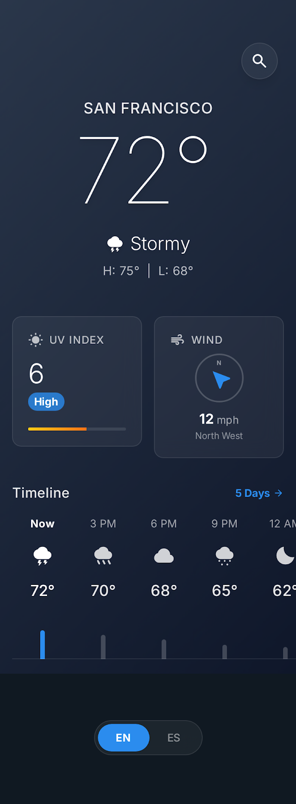
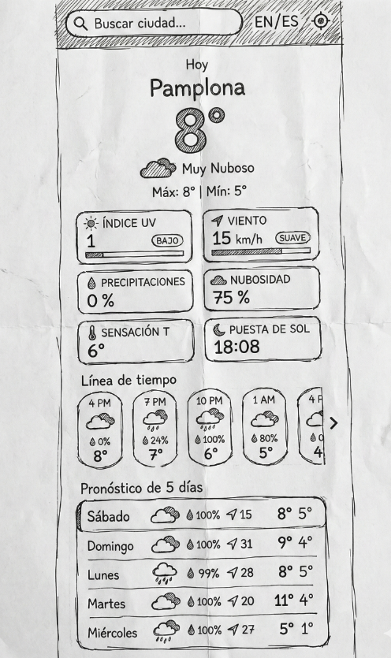

# Documentación de Diseño de Weather App

## 1. Filosofía de Diseño

La aplicación del tiempo está diseñada con una estética **Glassmorphism**, utilizando fondos translúcidos, efectos de desenfoque y un tema de degradado azul profundo para evocar una sensación moderna y premium adecuada para una aplicación meteorológica.

### Diseño Atómico (Atomic Design)

La estructura del proyecto sigue la metodología de **Diseño Atómico**:

| Nivel          | Descripción                           | Ejemplos                                          |
| :------------- | :------------------------------------ | :------------------------------------------------ |
| **Átomos**     | Bloques de construcción básicos       | Iconos, Etiquetas, Entradas, Botones              |
| **Moléculas**  | Grupos de átomos trabajando juntos    | Barra de búsqueda, Elemento de pronóstico del día |
| **Organismos** | Secciones complejas de la interfaz    | Encabezado, Lista de pronósticos                  |
| **Plantillas** | El diseño final combinando organismos | Página de inicio, Página de pronóstico            |

## 2. Paleta de Colores

Basada en el tema de la aplicación:

| Concepto           | Hex / Valor                | Descripción                        |
| :----------------- | :------------------------- | :--------------------------------- |
| **Fondo Primario** | `#141e30`                  | Azul Profundo / Cielo Nocturno     |
| **Texto Primario** | `#ffffff`                  | Blanco para alto contraste         |
| **Tarjetas**       | `rgba(255, 255, 255, 0.1)` | Blanco Translúcido (Glassmorphism) |
| **Acentos**        | `#141e30` → `#243b55`      | Degradados de fondo                |

## 3. Tipografía

- **Familia Tipográfica**: Predeterminada del sistema (_San Francisco_ en iOS, _Roboto_ en Android) para una sensación nativa.
- **Pesos**:
  - **Negrita/Heavy**: Para Temperaturas y Títulos.
  - **Regular**: Para texto del cuerpo.
  - **Light**: Para información secundaria.

## 4. Maquetas de UI (Mockups)

### Vista Móvil

La interfaz está optimizada para dispositivos móviles con un diseño limpio y táctil.

|      Pantalla Principal      |     Pantalla de Detalle      |
| :--------------------------: | :--------------------------: |
|  |  |

## 5. Experiencia de Usuario (UX)

> [!NOTE]
> La aplicación prioriza la respuesta visual inmediata y el manejo elegante de errores.

- **Búsqueda**: Los usuarios pueden buscar cualquier ciudad a través de la API de OpenWeather.
- **Geolocalización**: Opción para usar la ubicación actual del dispositivo.
- **Multilenguaje**: Soporte completo para **Inglés** y **Español**.
